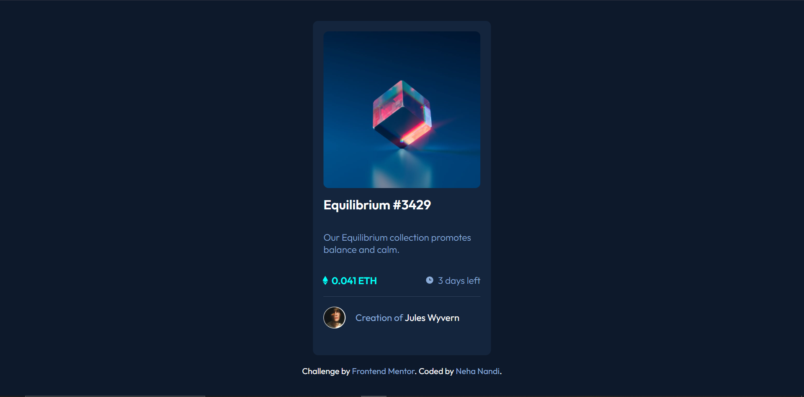

# Frontend Mentor - NFT preview card component solution

This is a solution to the [NFT preview card component challenge on Frontend Mentor](https://www.frontendmentor.io/challenges/nft-preview-card-component-SbdUL_w0U). Frontend Mentor challenges help you improve your coding skills by building realistic projects.

## Table of contents

- [Overview](#overview)
  - [The challenge](#the-challenge)
  - [Screenshot](#screenshot)
  - [Links](#link)
  - [Built with](#built-with)
  - [What I learned](#what-i-learned)
  - [Continued development](#continued-development)
- [Author](#author)
- [Acknowledgments](#acknowledgments)

## Overview

Built an NFT card component using HTML, CSS. Used the properties of flexbox to solve this challenge.

### The challenge

Users should be able to:

- View the optimal layout depending on their device's screen size
- See hover states for interactive elements

### Screenshot

### Links

- Link to repo: [https://github.com/nehanandi09/nft-preview-card-component-main](https://github.com/nehanandi09/nft-preview-card-component-main)
- Live site URL: [https://nehanandi09.github.io/nft-preview-card-component-main/](https://nehanandi09.github.io/nft-preview-card-component-main/)

### Built with

- Semantic HTML5 markup
- CSS custom properties
- Flexbox

### Continued development

Need to learn how to add hover state on images, and add a smooth transition to hover effects when the colours change

## Author

- Frontend Mentor - [@nehanandi09](https://www.frontendmentor.io/profile/nehanandi09)
- Twitter - [@nnandi09](https://twitter.com/nnandi09)

## Acknowledgments

I'd like to thank css-tricks, w3schools, and stackoverflow, and freecodecamp.org for their resources that helped me finish this challenge
